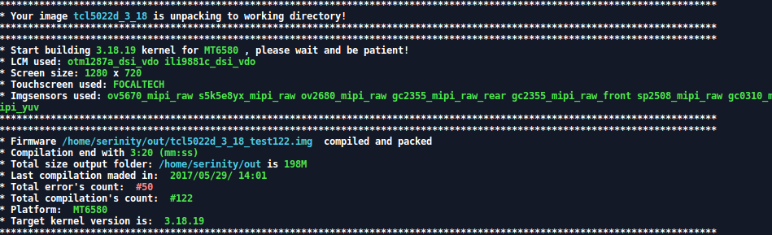

---
# Smart Script for Mediatek
---

This is simple script using to improve your compilation experience! No need more always write same command! Just once edit include file. \ Это простой скрипт, который позволит вам забыть о рутинных командах для сборки. Позволит в один миг собрать и упаковать ядро. 

---
Пример использования:

---
# Setup the script \ Настройка
---

- Put unpack_img to CarlivImage folder.
- Edit sipmle "include" file
- Use it for free!
---
- Пометите unpack_img в папку с CarlivImage 
- Отредактируйте include файл.
- Используйте в свое удовольствие

